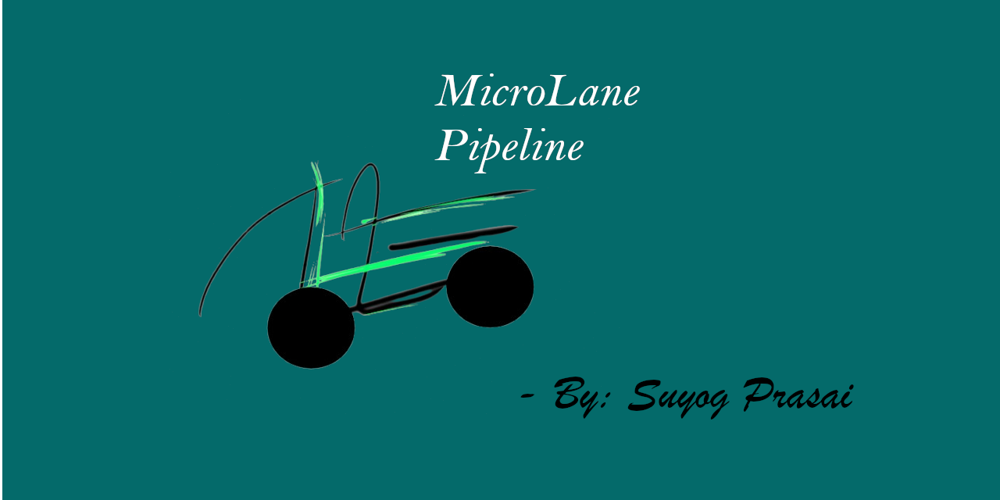
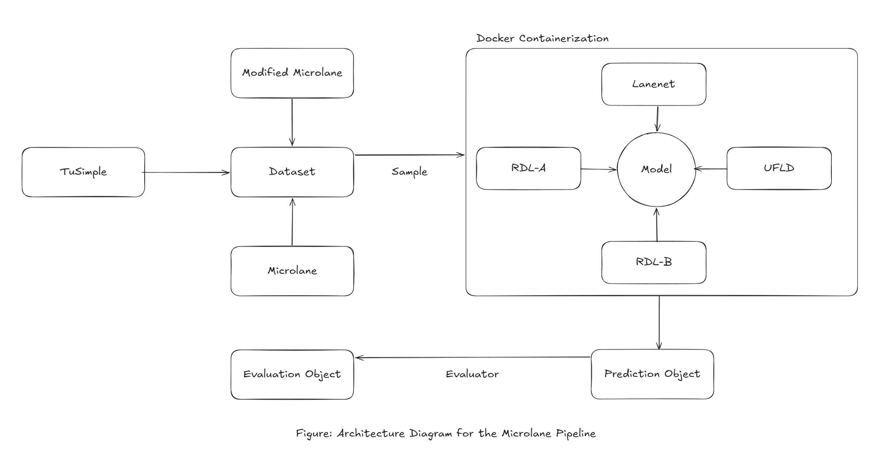

# Microlane Pipeline



The Microlane Pipeline is a machine learning pipelines that evaluates different lane detection model in 1/10 conditions. This pipeline has extensive capabilities to modify the input to the model, ensure smooth running of the models through docker containerization, running evaluations through multiple metrics, and store the results in a safe json format.

This pipeline was developed during the writing of the paper — **Microlane: Evaluating the Robustness of Lane Detection Models in a 1/10-scale Car**

We evaluated 4 different lane detection models on standard and custom image based lane detection datasets on 5 five different augmentation modes, generating about 27,000 predictions by processing about 81,000 images.

---

## Table of Contents

1. [Architecture](#architecture)
2. [Key Features](#key-features)
3. [Repository Structure](#repository-structure)
4. [Getting Started](#getting-started)
   - [Prerequisites](#prerequisites)
   - [Installation](#installation)
   - [Configuration](#configuration)
5. [Data Preparation](#data-preparation)
6. [Usage](#usage)
   - [Running Experiments](#running-experiments)
   - [Evaluating Results](#evaluating-results)
   - [Summarizing Results](#summarizing-results)
   - [Analyzing and Graphing](#analyzing-and-graphing)
7. [Models, Metrics and Filters](#models-metrics-and-filters)
8. [Contribution and License](#contribution-and-license)

---

## Architecture



- Three datasets, TuSimple, Microlane, and Modified Microlane, are normalized into a common TuSimple JSON-line format before being passed into the pipeline.
- Images are routed into a Docker container hosting one of four interchangeable models, LaneNet, UFLD, RLD-A, or RLD-B, each exposed via a FastAPI endpoint.
- The selected model processes the input and produces a structured Prediction Object, which is then passed to the evaluation layer.
- The evaluation layer computes Accuracy, FP, FN, and IoU metrics, consolidating them into a final Evaluation Object.

## Key Features

Key features include a modular architecture that makes it straightforward to add new models, datasets, or metrics. Furthermore, the pipeline is general enough to work with ML models beyond lane detection. Each model runs in a dedicated Docker container with a FastAPI endpoint, ensuring isolation and reproducibility.

The pipeline implements the standardized TuSimple benchmark alongside a flexible augmentation module, allowing easy simulation of real-world image conditions. A CLI interface exposes the evaluation and summary features, with room to grow into a fully-featured tool. Custom scripts are also included to convert CVAT for Images XML annotations into TuSimple format.

## Repository Structure

```
├── microlane/            # Core library source code
│   ├── augmentation/     # Image augmentation filters
│   ├── datasets/         # Data loaders for TuSimple and MicroLane
│   ├── evaluation/       # Evaluation logic (TuSimple metrics, IoU)
│   ├── models/           # Wrappers for containerized models
│   ├── schemas/          # Pydantic and dataclass schemas
│   └── utils/            # Utilities for config, Docker, etc.
├── results/              # Output directory for experiments and graphs
├── scripts/              # CLI tools and notebooks
│   ├── commands/         # CLI command implementations
│   ├── core/             # Core logic for script commands
│   ├── graphing.ipynb    # Notebook for data analysis and visualization
│   └── *.py              # Utility scripts for data conversion
├── config.yaml           # Central configuration file
└── pyproject.toml        # Project dependencies and setup
```

---

## Getting Started

- ### Prerequisites
   - You need to have **Python 3.12.10** to run this code. Other Python versions have not been tested on this code. Along with that, you need to install **Docker Desktop** to run containers in your local machine. Also, install **poetry** and **pyenv** for Python version and dependency management.

- ### Installation

   1. First, install the [prerequisites](#prerequisites) in your local machine, and clone this repository.

      ```bash
      git clone https://github.com/suyogprasai/microlane.git
      cd microlane
      ```
   2. Then, set the correct Python version ( 3.12.10 ), and install dependencies after activating the virtual environment using poetry.
      ```bash
      pyenv local 3.12.10
      eval (poetry env activate)
      poetry install
      ```
   3. You need to install the package using `pip install -e .` command to use the CLI tools developed for evaluation and summarization.

- ### Configuration
   - Before running the experiments, make sure to download all the datasets in your local machine. Have the Experiment Output Directory Structure ready, and configure the `config.yaml` ( the main file for all the options that can be set for the experiments ).

## Data Preparation

This project uses the **[TuSimple](https://www.kaggle.com/datasets/manideep1108/tusimple)** dataset and a custom **[Microlane](https://drive.google.com/drive/folders/1OVeSnmBn68Gn8OlUpOjSTFAoEAK-vlFK?usp=sharing)** dataset. The Microlane dataset is originally in the **XML CVAT for Image 1.1** format, so it must be converted to TuSimple's JSON-line format before use.

```bash
python scripts/microlane_to_tusimple.py \
 --annotations /home/suyog/assets/datasets/MicroLane/annotations.xml \
 --microlane /home/suyog/assets/datasets/MicroLane/microlane \
 --modified /home/suyog/assets/datasets/MicroLane/modified_microlane
```

This produces a `normalized_microlane/` directory with resized images and an `annotations.json` file. Update `config.yaml` to point to these generated assets. You can also visualize these new files over the new ground truth values using the following command:

```bash
python scripts/visualize_converted.py \
 --images results/normalized_microlane/modified_microlane/ \
 --annotations results/normalized_microlane/annotations.json
```

## Usage

- ### Running Experiments
   - Experiments are run through Jupyter Notebooks, which handle data loading, augmentation, and model inference. There are two main inference notebooks right now: `scripts/inference.ipynb` ( takes in single image ) and `scripts/sequence_inference.ipynb` ( takes in multiple images ).
  

   - Before running, edit the configuration block at the top of the notebook to select the desired `MODEL`, `DATASET`, and `AUGMENTATION` preset. The notebook will automatically start the required Docker container and store raw results and visualizations in the configured experiment directory.
   

   | Model Type | Notebook |
   |---|---|
   | Single-frame (LaneNet, UFLD) | `scripts/inference.ipynb` |
   | Sequence-based (RLD-A, RLD-B) | `scripts/sequence_inference.ipynb` |

   ***Note***: We had to manually change the value for each result that we make, so we had to change the variables about 60 times manually.


- ### Evaluating Results

   - It took us 3 days to run all the experiments on our local machine, after which we had to run evaluations. ( Which means processing all the output produced by a lane detection model and comparing that with the ground truth, through which we generate different types of metrics like accuracy and IoU. )


   ```bash
   microlane evaluate \
   -p /home/suyog/desktop/projects/microlane/results/experiment \
   -c /home/suyog/desktop/projects/microlane/results/experiment/evaluate.csv
   ```
   - The above command recursively scans the `Experiment` directory, processing all `prediction.json` files to compute metrics for each prediction and consolidate results into a single `evaluate.csv` file.


- ### Summarizing Results
   - Then, we need to create a summary by looking into each experiment group, and creating summary data like averages, standard deviation, quartiles, etc.

   ```bash
   microlane summarize \
   -p /home/suyog/desktop/projects/microlane/results/experiment/evaluate.csv \
   -c /home/suyog/desktop/projects/microlane/results/experiment/summary.csv
   ```


- ### Analyzing and Graphing

   - We mainly use `graphing.ipynb` and `testing.ipynb` to generate different graphs and visualizations to compare the experiment data. Mainly, we use the following graphs:

      - **Bar charts:** Compare model and augmentation performance.
      - **Line graphs:** Cumulative accuracy over samples.
      - **Radar charts:** False Negative vs. False Positive rate comparisons.


## Models, Metrics and Filters

- Our pipeline evaluates four models, two single-frame and two sequence-based, as described below.

| Model | Type | Description |
|---|---|---|
| **[LaneNet](https://github.com/MaybeShewill-CV/lanenet-lane-detection)** | Single-frame | Segmentation-based model using binary and instance segmentation. |
| **[UFLD](https://github.com/cfzd/Ultra-Fast-Lane-Detection#)** | Single-frame | Formulates lane detection as row-based classification for high-speed inference. |
| **[RLD-A](https://github.com/qinnzou/Robust-Lane-Detection)** | Sequence-based | UNet backbone with ConvLSTM to leverage temporal information across frames. |
| **[RLD-B](https://github.com/qinnzou/Robust-Lane-Detection)** | Sequence-based | Variant of RLD-A using a SegNet backbone instead of UNet. |

- Our pipeline employs four metrics, three sourced from the TuSimple benchmark and one custom ego-lane IoU, as described below.

| Metric | Source | Description |
|---|---|---|
| **Accuracy** | [TuSimple](https://github.com/TuSimple/tusimple-benchmark) | Proportion of correctly predicted lane points per image. |
| **FP** | [TuSimple](https://github.com/TuSimple/tusimple-benchmark) | Rate of predicted lanes with no matching ground-truth lane. |
| **FN** | [TuSimple](https://github.com/TuSimple/tusimple-benchmark) | Rate of ground-truth lanes that went undetected. |
| **IoU** | Custom | IoU between the predicted ego-lane polygon and its ground-truth counterpart. |

- Our pipeline tests five augmentation presets, ranging from no augmentation to motion and lighting variants, as described below.

| Augmentation | Description |
|---|---|
| **Normal** | No augmentation. |
| **Motion Blur** | Horizontal motion blur using a kernel of size 21. |
| **Camera Shake** | Random rotation (−5° to +5°) combined with random odd-sized horizontal motion blur. |
| **Lighting-B** | Brightness increase of 40% (all RGB channels +40% of 255). |
| **Lighting-D** | Brightness decrease of 40% (all RGB channels −40% of 255). |


## Contribution and License

If you want to contribute to this project, then feel free to fork and add the necessary adjustments. This pipeline is designed in a way such that it works not just on lane detection models, but on all kinds of machine learning models. This project is licensed under the Apache License 2.0. See the [LICENSE](LICENSE) file for details.