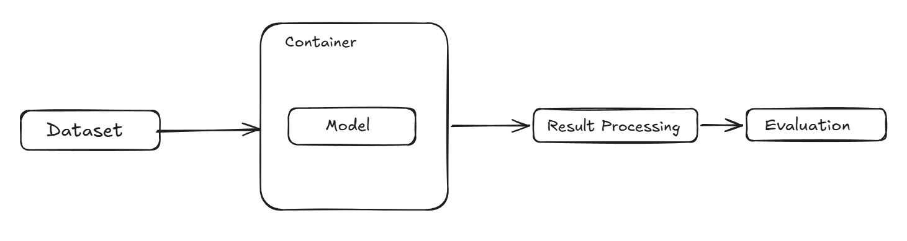

# Microlane

Evaluating how well modern lane detection models hold up when deployed on small-scale 1/10 RC cars. We benchmark LaneNet, Ultra Fast Lane Detection, and a ConvLSTM-based DNN against the TuSimple and CULane datasets, then test them on a custom RC car footage dataset under real-world edge conditions.

LaneNet Link: https://github.com/MaybeShewill-CV/lanenet-lane-detection

We have used a custom model evaluation pipline to make evaluatoins of different models and datsets for lane detction.

The pipeline can use multiple datasets easily by using code to infer "Samples" fromt these datasets, which is a common object that can be processed by other modules of the pipepline.

We can easily apply different filetrs like brightness, rotation, zooming, and blur filters and test data based on that. As such we would be able to draw consistent comparison between models.

